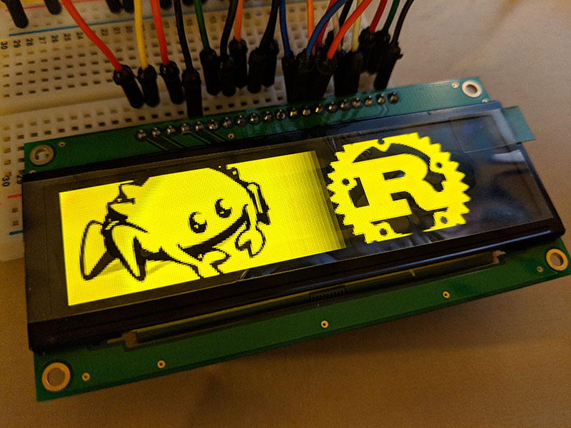

# SSD1322 OLED display driver

*Work in progress!*

Pure Rust driver for the SSD1322 OLED display, for use with
[embedded-hal](https://crates.io/crates/embedded-hal).

## Description

This driver is intended to work on embedded platforms using the embedded-hal
trait library. It is `no_std`, contains no added `unsafe`, and does not require
an allocator. The initial release supports the 4-wire SPI interface.

Because the SSD1322 supports displays as large as 480x128 @ 4bpp, the primary
API uses a `Region` abstraction to allow writing a stream of pixel data from an
iterator onto a rectangular sub-region of the display area. This avoids the
requirement to buffer the entire display RAM in the host, since such a buffer
would consume a colossal (for a μC) 30kiB of RAM.

### Missing features:

- Writing non-packed image data (e.g. 1bpp or 8bpp).
- [embedded-graphics](https://github.com/jamwaffles/embedded-graphics)
  `Drawing` support.
- I2C interface support.
- Text mode and/or fonts.

## Acknowledgements

[jamwaffles/ssd1306](https://github.com/jamwaffles/ssd1306) for internal design
inspiration.
[japaric/embedded-hal](https://github.com/japaric/embedded-hal) for making
dealing with embedded hardware easy, safe, and enjoyable.

## License

Licensed under either of

- Apache License, Version 2.0 (http://www.apache.org/licenses/LICENSE-2.0)
- MIT license (http://opensource.org/licenses/MIT)

at your option.

### Contribution

Unless you explicitly state otherwise, any contribution intentionally submitted
for inclusion in the work by you, as defined in the Apache-2.0 license, shall
be dual licensed as above, without any additional terms or conditions.
